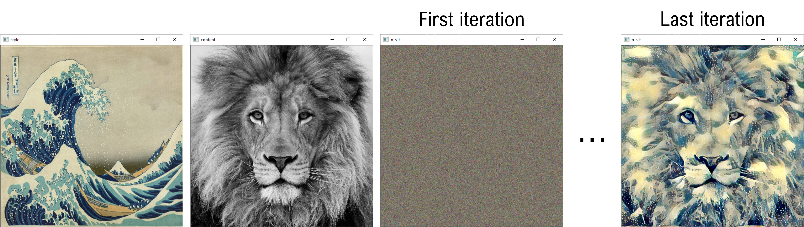

# Neural Style Transfer (with app)

This repository includes a Pytorch implementation of the paper
"[Image Style Transfer Using Convolutional Neural Networks](https://www.cv-foundation.org/openaccess/content_cvpr_2016/papers/Gatys_Image_Style_Transfer_CVPR_2016_paper.pdf)", 
Leon A. Gatys et al. that can run locally with an app (`app.py` -developed with Streamlit) or by modifying the input arguments of a script (`main.py`).

## Brief description

**Neural Style Transfer** (NST) is a deep learning technique that generates an 
image based on the content of one image (the *content image*) and the style of another image (the *style image*).  

Have a look at the next example generated with this repository. 
The **content** and **style** images are located at the top-left and top-right corners respectively, 
and the bottom row contains the **output** (stylized) image.

<p align="center">

</p>

## Installation with conda

These instructions assume that [Anaconda](https://www.anaconda.com/products/individual) or [Miniconda](https://docs.conda.io/en/latest/miniconda.html) are installed in the computer.

1. Open Anaconda Prompt and clone this repository in the desired path, and enter to it:
   ```Shell
   cd <your_custom_directory_name>
   git clone https://github.com/javiertg9/neural-style-transfer-app
   cd neural-style-transfer-app
   ```
2. Create the environment with the needed dependencies with the provided `environment.yaml` file of this repo:
   ```Shell
   conda env create -f environment.yml
   ```
3. Activate the environment:
   ```Shell
   conda activate nst-app
   ```

## How to use it

There are two ways to run this repository. The first one is through the app (`app.py`) done with [Streamlit](https://github.com/streamlit/streamlit):

### 1) Running the app

You can run it simply by typing in the Anaconda Prompt the following command:
```Shell
Streamlit run app.py
```
Then, your default browser should open locally the following page:
<p align="center">

</p>

Here it is a video showing how you can use the demo. 
Its configuration relies on the parameters for performing NST that are located at the left sidebar:
- **Weights** of the loss function,
- number of **iterations** of the optimization process,
- and checkbox to **save** or not the resulting stylized image.

https://user-images.githubusercontent.com/71815905/152897543-2d227393-50a8-4daf-90bc-69c7bd31b369.mp4

### 2) Running the script

You can run the default images/ parameter values by using the next command:
```Shell
python main.py
```
Doing so, there will appear the following triplet of openCV windows:
<p align="center">

</p>

To stop the optimization process before it finishes just press in the keyboard `q`. 
This will stop the execution and save, if specified, the resulting image.

But you can also change the images or parameter values and decide 
if you want to save the resulting image in the `data/ouput-images` folder.  
These are the parameter specifications that appear after executing `python main.py --help`:

<details>
  <summary>[Clik to expand and see the optional parameters]</summary>

  ```Shell
  usage: main.py [-h] [--content_img_name CONTENT_IMG_NAME]
                 [--style_img_name STYLE_IMG_NAME]
                 [--content_weight CONTENT_WEIGHT] [--style_weight STYLE_WEIGHT]
                 [--tv_weight TV_WEIGHT] [--model {vgg16,vgg19}]
                 [--save_stylized_image] [--niter NITER]
  
  optional arguments:
    -h, --help            show this help message and exit
    --content_img_name CONTENT_IMG_NAME
                          name and extension of the CONTENT image located at the
                          "data/content-images" folder. For example: lion.jpg
    --style_img_name STYLE_IMG_NAME
                          name and extension of the STYLE image located at the
                          "data/style-images" folder. For example: wave.jpg
    --content_weight CONTENT_WEIGHT
                          weight (importance) of the CONTENT image in the
                          resulting stylized image
    --style_weight STYLE_WEIGHT
                          weight (importance) of the STYLE image in the
                          resulting stylized image
    --tv_weight TV_WEIGHT
                          The higher value of this weight, the higher degree of
                          smoothness in the stylized image
    --model {vgg16,vgg19}
                          Select which VGG model (vgg16 or vgg19) to use to
                          define the perceptual losses (recommendation: choose
                          vgg19 as it offers better results)
    --save_stylized_image
                          write this flag if you want to save the resulting
                          stylized image
    --niter NITER         Number of iterations to perform during the
                          optimization process
  ```

</details>

For example, if we execute the following command:
```Shell
python main.py --content_img_name=bridge.jpeg --style_img_name=vangogh2.jpg --content_weight=0.001 --niter=40 --save_stylized_image
```
then the result will be:
<p align="center">

</p>

and we would get in `data/ouput-images` the image called `cbridge_svangogh2.jpg`:
<p align="center">

</p>

## Useful resources

To do this implementation I found the following works to be highly useful:

- [NST YouTube playlist](https://www.youtube.com/watch?v=S78LQebx6jo&list=PLBoQnSflObcmbfshq9oNs41vODgXG-608&ab_channel=TheAIEpiphany) of [AI epiphany](https://www.youtube.com/channel/UCj8shE7aIn4Yawwbo2FceCQ), and its related repository: [pytorch-neural-style-transfer](https://github.com/gordicaleksa/pytorch-neural-style-transfer),
- the paper "[Very Deep Convolutional Netowrks for Large-Scale Image Recognition](https://arxiv.org/pdf/1409.1556.pdf)", Simonyan et al., for understanding the VGG-net architecture,
- [Pytorch](https://github.com/pytorch/examples/tree/master/fast_neural_style/neural_style) and [Torchvision](https://github.com/pytorch/vision/blob/main/torchvision/models/vgg.py) implementations of the VGG-net,
- and of course the [original paper](https://www.cv-foundation.org/openaccess/content_cvpr_2016/papers/Gatys_Image_Style_Transfer_CVPR_2016_paper.pdf).

The images used in this repo have been mainly obtained from these sources:

- [V. Van Gogh paintings from rawpixel](https://www.rawpixel.com/board/537381/vincent-van-gogh-free-original-cc0-public-domain-paintings),
- [images from this repo](https://github.com/cysmith/neural-style-tf/),
- [bridge pic](https://www.pexels.com/photo/gray-bridge-and-trees-814499/).
